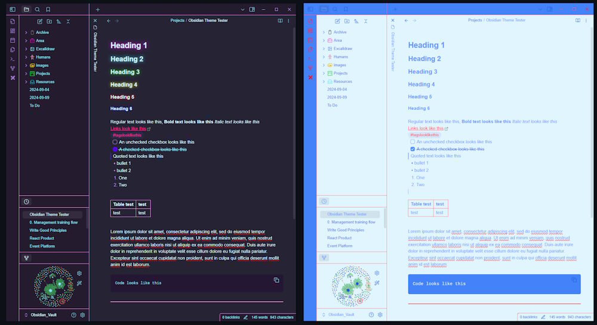

# Neon-Synthwave

 

  

    An Obsidian theme inspired by <a href="https://marketplace.visualstudio.com/items?itemName=RobbOwen.synthwave-vscode">SynthWave '84 VSCode theme by Robb Owen</a> and <a href="https://github.com/deathau/80s-Neon-for-Obsidian.md">80s Neon Obsidian theme by deathau</a>.
     
    <a href="https://github.com/grjsmith/Neon-Synthwave"><strong>Explore the docs »</strong></a>
     
     
    <a href="https://github.com/grjsmith/Neon-Synthwave/issues">Report Bug</a>
    ·
    <a href="https://github.com/grjsmith/Neon-Synthwave/issues">Request Feature</a>
  

<!-- TABLE OF CONTENTS -->

  
Table of Contents

  <ol>
    <li>
      <a href="#about-the-project">About The Project</a>
      <ul>
        <li><a href="#built-with">Built With</a></li>
      </ul>
    </li>
    <li>
      <a href="#getting-started">Getting Started</a>
      <ul>
        <li><a href="#prerequisites">Prerequisites</a></li>
        <li><a href="#installation">Installation</a></li>
      </ul>
    </li>
    <li><a href="#usage">Usage</a></li>
    <li><a href="#roadmap">Roadmap</a></li>
    <li><a href="#contributing">Contributing</a></li>
    <li><a href="#license">License</a></li>
    <li><a href="#contact">Contact</a></li>
    <li><a href="#acknowledgments">Acknowledgments</a></li>
  </ol>

<!-- ABOUT THE PROJECT -->
## About The Project
Personal Knowledge Management Systems like Evernote, Notion and Obsidian have been an obsession of mine for years. I have finally committed to Obsidian simply because I can theme it just the way I want to. Synthwave music and the aesthetic is another obsession of mine and with this theme I combine the two. I recommend listening to <a href="https://open.spotify.com/artist/0603X4AUnZec4wiHJNsynF">Dreamkid</a> while writing your Morning pages.

(<a href="#top">back to top</a>)

### Built With
* [Obsidian](https://obsidian.md/)
* [VSCode](https://code.visualstudio.com/)

(<a href="#top">back to top</a>)

<!-- GETTING STARTED -->
### Installation

- Download and run Obsidian
- Click the Gear icon to bring up the Obsidian Options Window
- In the left hand navigation menu click on Appearance
- Click the Manage button to the right of Themes
- Type Neon in the search filter
- Select Neon Synthwave
- Click the Install button

(<a href="#top">back to top</a>)

<!-- USAGE EXAMPLES -->
<!--## Usage

Use this space to show useful examples of how a project can be used. Additional screenshots, code examples and demos work well in this space. You may also link to more resources.

_For more examples, please refer to the [Documentation](https://example.com)_

(<a href="#top">back to top</a>)
-->

<!-- ROADMAP -->
## Roadmap

- I don't know what doesn't work yet. I created the most basic theme I could following the <a href="https://docs.obsidian.md/Themes/App+themes/Build+a+theme">official Obsidian instructions</a> so I have left a lot of settings at the defaults because I think they work well. If you notice something that needs theming then open an issue.

See the [open issues](https://github.com/grjsmith/dotfiles/issues) for a full list of proposed features (and known issues).

(<a href="#top">back to top</a>)

<!-- CONTRIBUTING -->
## Contributing
Contributions are what make the open source community such an amazing place to learn, inspire, and create. Any contributions you make are **greatly appreciated**.

If you have a suggestion that would make this better, please fork the repo and create a pull request. You can also simply open an issue with the tag "enhancement".
Don't forget to give the project a star! Thanks again!

1. Fork the Project
2. Create your Feature Branch (`git checkout -b feature/AmazingFeature`)
3. Commit your Changes (`git commit -m 'Add some AmazingFeature'`)
4. Push to the Branch (`git push origin feature/AmazingFeature`)
5. Open a Pull Request

(<a href="#top">back to top</a>)

<!-- LICENSE -->
## License

This work is marked with <a href="https://creativecommons.org/publicdomain/zero/1.0/?ref=chooser-v1" target="_blank" rel="license noopener noreferrer" style="display:inline-block;">CC0 1.0</a>

(<a href="#top">back to top</a>)

<!-- CONTACT -->
## Contact

Grant Smith - [@grjsmith](https://twitter.com/grjsmith) - grant@nextgendevops.com

Project Link: [https://github.com/grjsmith/Neon-Synthwave](https://github.com/grjsmith/Neon-Synthwave)

(<a href="#top">back to top</a>)

<!-- ACKNOWLEDGMENTS -->
## Acknowledgments
* Thanks to the Obsidian team for the awesome software and tutorials
* Thanks to Robb Owen for his aweosme SynthWave '84 VSCode theme and deathau for the amazing 80s Neon Obsidian theme.

(<a href="#top">back to top</a>)

<!-- MARKDOWN LINKS & IMAGES -->
<!-- https://www.markdownguide.org/basic-syntax/#reference-style-links -->